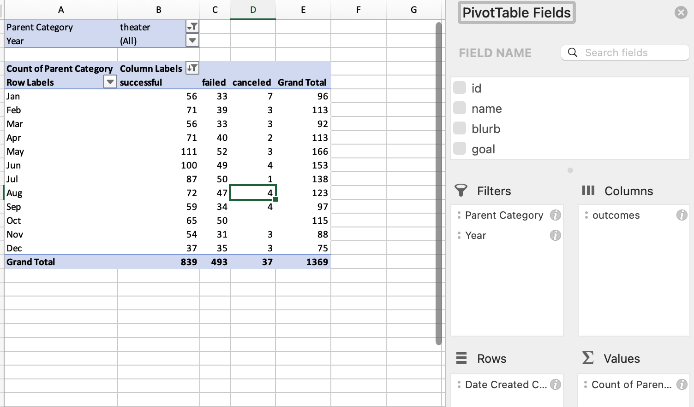
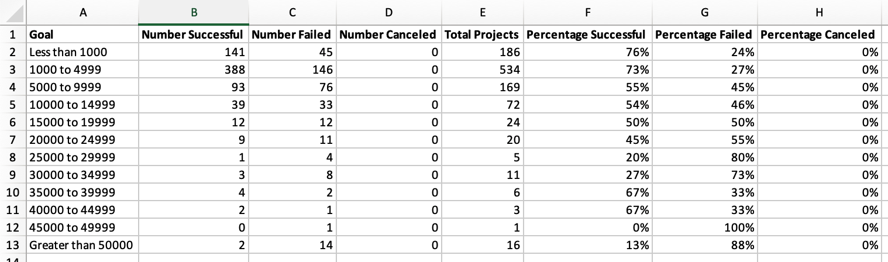
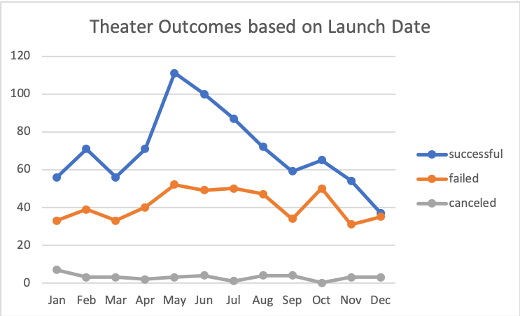
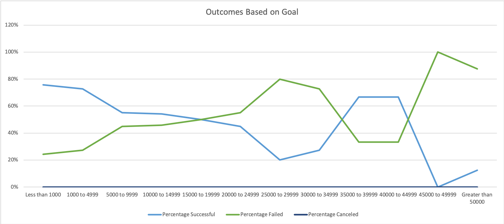

# Kickstarter-Analysis
Performing analysis on Kickstarter data to uncover trends

## Table of Contents
- [1.0 Introduction](#Introduction)
  * 1.1 Purpose
  * 1.2 Tools
- [2.0 Analysis and Challanges](#Analysis-and-Challenges)
  * 2.1 Theater Outcomes by Launch Date
  * 2.2 Outcomes Based on Goals
- [3.0 Results](#Results)
  * 3.1 Theater Outcomes by Launch Date
  * 3.2 Outcomes Based on Goals
- [4.0 Resources](#Resources)

## 1.0 Introduction

### 1.1 Purpose
Louise wants to analyise how plays how different campaigns compared to their launch date and goals.
The purpose of this analysis is to be able to identify the amount of plays that were successful, failed, or canceled based off of the launch date and year.  As well as how the plays performed based off the goal. These two analyses can provide a clear insight to the date and goal to set in order to have more successful plays. 

### 1.2 Tools
- Excel
  - Pivot Tables
  - Line Chart

## 2.0 Analysis and Challenges
### 2.1 Theater Outcomes by Launch Date
The analysis for “Theater Outcomes by Launch Date” was created by first editing the time stamps from Unix to a short date, and then creating a pivot table to aggregate the data.  By translating the Unix time stamp to short date using the following formula: 

`=((("Unix Date"/60)/60)/24)+DATE(1970,1,1)`. 

A pivot table was created to display the outcome of the theaters based off of the month that they were launched.This way you can filter on the year the theater was launched to see if there is a trend in the data, as well as to see if there is an overall trend over the years.   

The main challenges faced in this, was sorting the outcomes in descending order. 

### 2.2 Outcomes Based on Goals
The analysis for "Outcomes Based on Goals" was created by creating a table in a new sheet by listing out the column and row headers.  The table was populated with the count of each "successful", "failed", and "canceled" play for each 5000 goal range using the following formula:

`=COUNTIFS("Goal_Column">=1000","Goal_Column","<5000","Subcategory_Column","plays","Outcome_Column","successful")`

The totals were converted to percentages to be able to compare the goal ranges on a common scale. 
The main challenges were copying the row ranges correctly into the Excel file.  Initially a row was missed, which caused the sum of two goal ranges to be combined, which caused the interval to change. Another challenge was having the correct "Countifs" statement written.  After refrencing a exceljet I was able to properly formulate the formula with multiple conditions.  

## 3.0 Results
### 3.1 Theater Outcomes by Launch Date
The peak months, April to August, are when the most theaters met or exceeded their goal. The maximum number of plays is in the month of May, and the ratio of successful vs failed is also the greatest in May and June.  From 2009 - 2013 all the plays were successful and then there is a sharp increase in the total number of plays after that.

The availability of data limited the analysis, as data from 2009 to 2013 only contianed successful plays.  The data could also be displayed in a bar chart.

### 3.2 Outcomes Based on Goals
The successful vs failed plays has an inverse relationship when split into goal ranges. Plays are successful for goals that are under $1500 and meet at an intersect where majority of the plays failed till $35,000.  Plays were more successful from $35,000 to $50,000, and beyond that the plays have a higher rate to fail than succeed.  

The data has limitations as the currency for each goal varies globally, and the data was not coverted into a standard currency to properly compare the range of successful, failed, and canceled plays.  The data could be dispalyed in a stacked percentage bar chart, or multiple pie charts. 

## 4.0 Resources
exceljet.net - learn how to write a countifs statement
